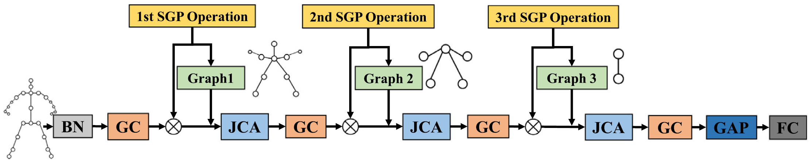

# SGP-JCA

## Introduction

This repository holds the codebase for the paper:

**Graph convolutional network with structure pooling and joint-wise channel attention for action recognition** Chen, Yuxin and Ma, Gaoqun and Yuan, Chunfeng and Li, Bing and Zhang, Hui and Wang, Fangshi and Hu, Weiming, Pattern Recognition 2020. [paper](https://www.sciencedirect.com/science/article/pii/S0031320320301242)




## Prerequisties

- Python3.6
- Pytorch1.2.0


### Installation

```
git clone https://github.com/Uason-Chen/SGP-JCA.git
cd SGP-JCA
pip install -e torchlight
```


## Data Preparation

### NTU-RGB+D

NTU-RGB+D can be downloaded from [link](http://rose1.ntu.edu.sg/datasets/actionrecognition.asp). Only the 3D skeletons (5.8G) modality is required in our experiments. After that, run the following command to build the dataset for training or evaluation:

```
cd tools
python ntu_gendata.py --data_path <path to nturgbd_skeletons_s001_to_s017.zip>
```


## Training

```
python main.py --config config/sgp+jca/<dataset>/train.yaml --work-dir <work folder>
```

where `<dataset>` can be `nturgbd-cross-subject` or `nturgbd-cross-view`. The training results, including model weights, configurations and logging files, will be saved under `<work folder>`.


## Evaluation

```
python main.py --config <work folder>/config.yaml --phase test --work-dir <work folder> --weights <work folder>/<weights>
```

where `<weights>` is the model weights ended with `.pth`. For example, the provided pre-trained model on NTU-RGB+D Cross Subject can be evaluated by running the following command:

```
python main.py --config config/sgp+jca/nturgbd-cross-subject/test.yaml --phase test --work-dir ./weights --weights ./weights/ntucs.pth
```


## Citation

Please cite the following paper if you use this repository in your research.

```
@article{chen2020graph,
  title={Graph convolutional network with structure pooling and joint-wise channel attention for action recognition},
  author={Chen, Yuxin and Ma, Gaoqun and Yuan, Chunfeng and Li, Bing and Zhang, Hui and Wang, Fangshi and Hu, Weiming},
  journal={Pattern Recognition},
  pages={107321},
  year={2020},
  publisher={Elsevier}
}
```

